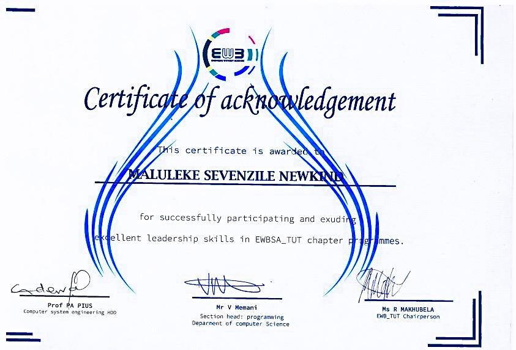
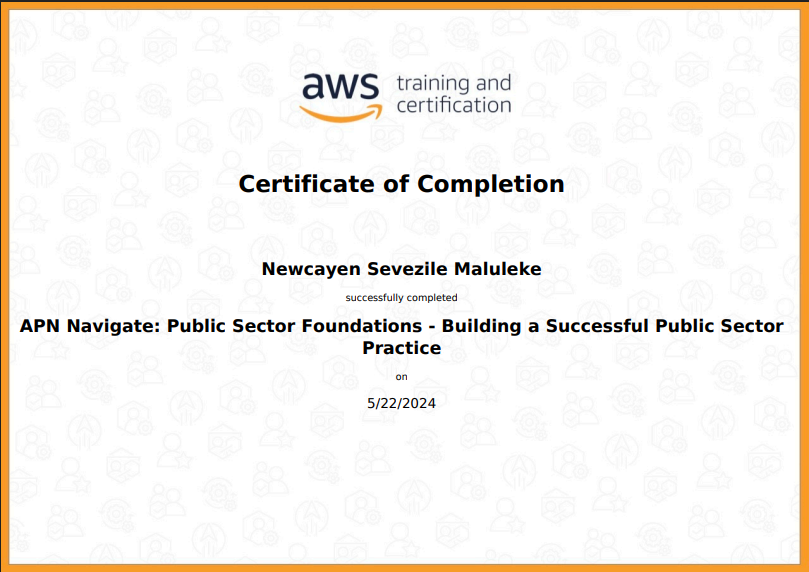

# FULL STACK DEVELOPER  

## 🧰 Languages and Tools  

  
    
    
    
    
    
    
    
    
    
    
    
    
    
    
    

  

---

## 💼 Professional Experience  

### 🔹 Full Stack Developer 
- Back-End:  **Java  |  C#  |  Python  |  PHP  |  Node.js  |  Spring Boot.**
- Front-End: **HTML5 | CSS3 | JavaScript | React.js | Tailwind | Typescript | Bootstrap frameworks.**
- Database: **SQL | PHP | MariaDB | MongoDB | PostgreSQL | Firebase.**  
- Deploying solutions and Intergration: **Linux | AWS | GCP | Cpanel.**

---

## 📂 Featured Repositories  

|  |  |  |  |
|---|---|---|---|
| AI-powered Education platform | CRM automation & integration | Ecommerce online store | Financial dashboards & analytics |
| 🔗 [Repo](https://github.com/MalulekeNS/EduPath)   🌠[Live](https://malulekens.github.io/EduPath/) | 🔗 [Repo](https://github.com/MalulekeNS/Salesforce)   🌠[Live](https://malulekens.github.io/Salesforce/) | 🔗 [Repo](https://github.com/MalulekeNS/Spelete)   🌠[Live](https://malulekens.github.io/Spelete/) | 🔗 [Repo](https://github.com/MalulekeNS/AfricanBank_Programme)   🌠[Live](https://malulekens.github.io/AfricanBank_Programme/) |

---

# Business Analyst  

  
    
    
    
    
    

  

<table>
<tr>
<td valign="top">

**From each Company or Client, we gather these documents:**  
- Finance  
- Governance  
- Compliance  
- Operational  
- Technical  
- Legal  

</td>
<td valign="top">

**To produce the following documents:**  
- Business Plan  
- As Is  
- Growth Plan  
- Company Strategy  
- Market Analysis  
- To-Be  
- Gap Analysis  
- Strategic Roadmap  
- Financial Report  
- Credit Rating Report  

</td>
</tr>
</table>

**
<b>The reports support funding readiness and investor confidence. </b>
**  

---

### 📂 Company Documentation Showcase  
- Click to View:

    
    
    
    
    
    
    
    
    
    

  

---

## 🎓 Certifications  
- To stay up-to-date with evolving and emerging current technologies, I enroll myself certifications:

  
    
    
    
   
    
    
  
  
  
  
  
  
  
  
  
  
  
  
  

  

 🎖️

---

## 📊 GitHub Stats  

  
    
    

  
